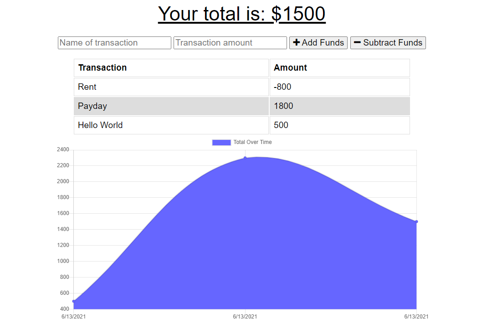

# Budget Tracker

a budget tracker built around mongodb, indexedDB, express, and good old HTML 

## Meta

Zachary Eggert – [@eggertZachary](https://twitter.com/eggertZachary) – eggert.zachary@gmail.com

Distributed under the MIT license. See ``LICENSE`` for more information.

[https://github.com/ZacharyEggert/](https://github.com/ZacharyEggert/)
